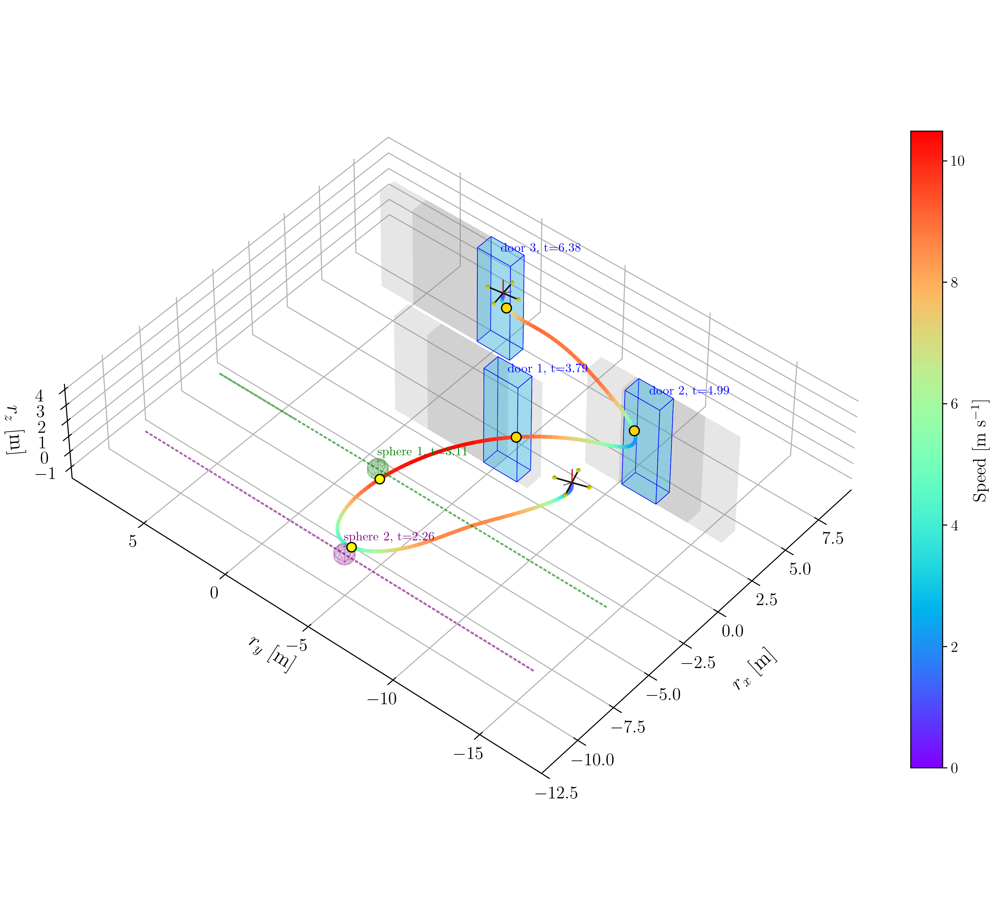
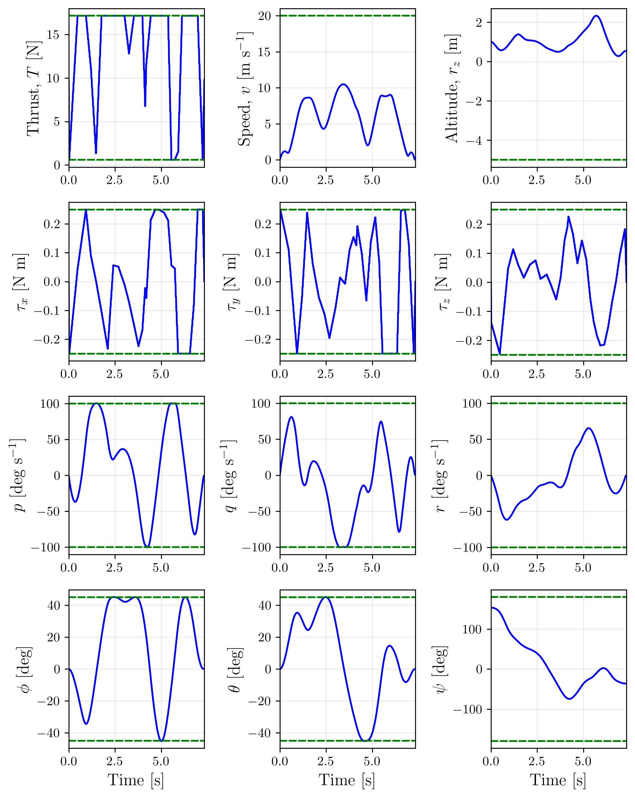
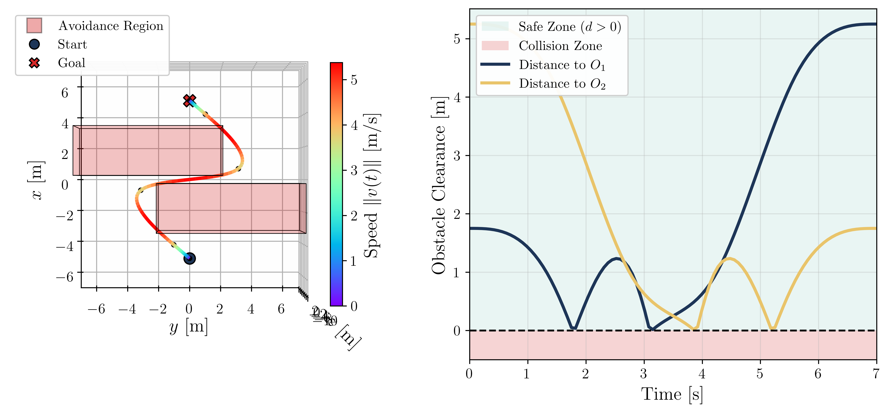
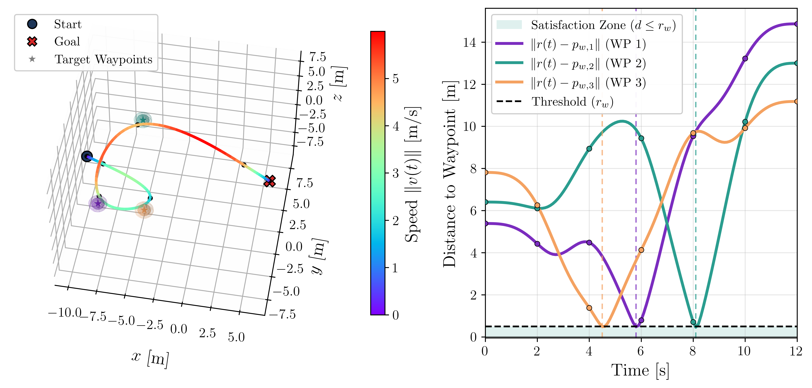
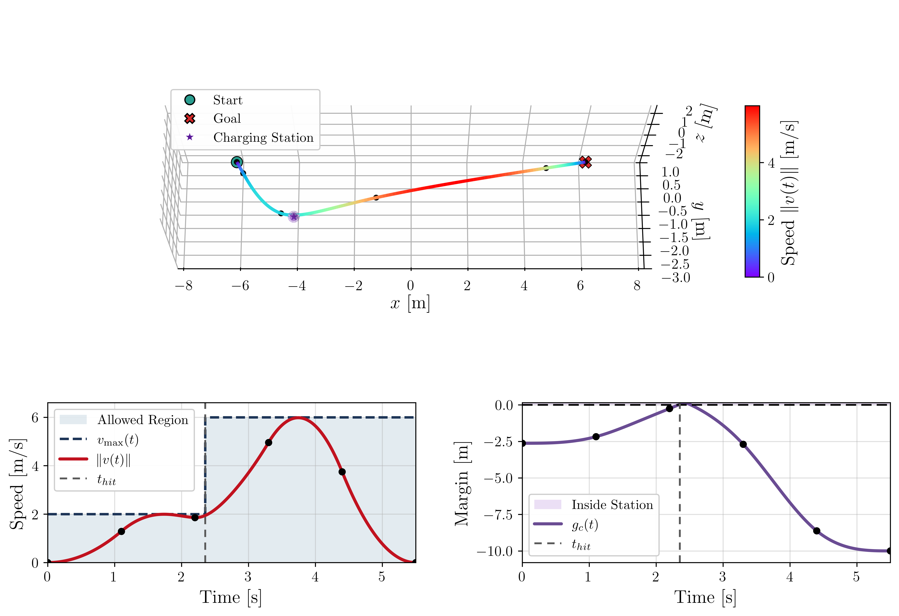
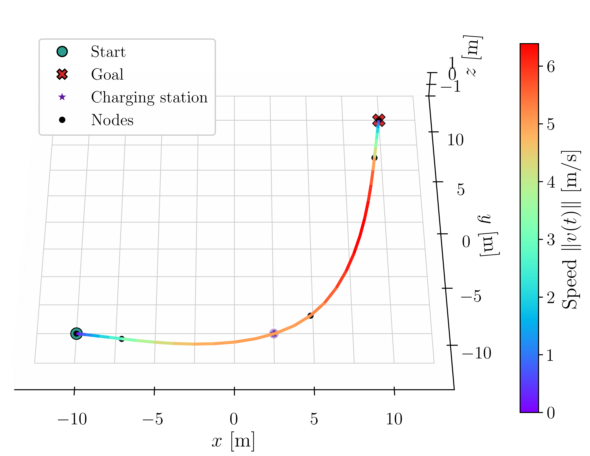
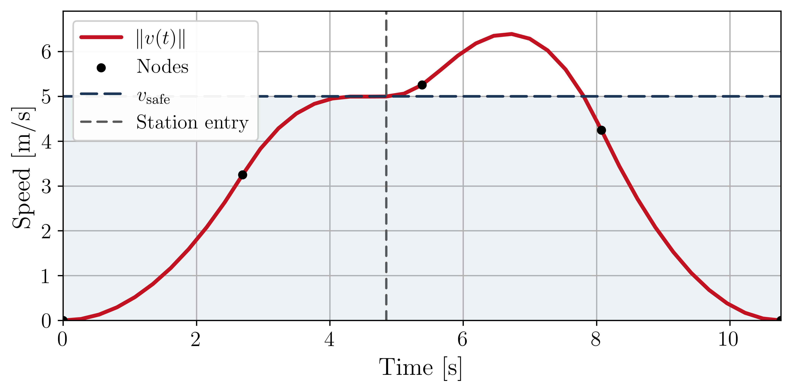
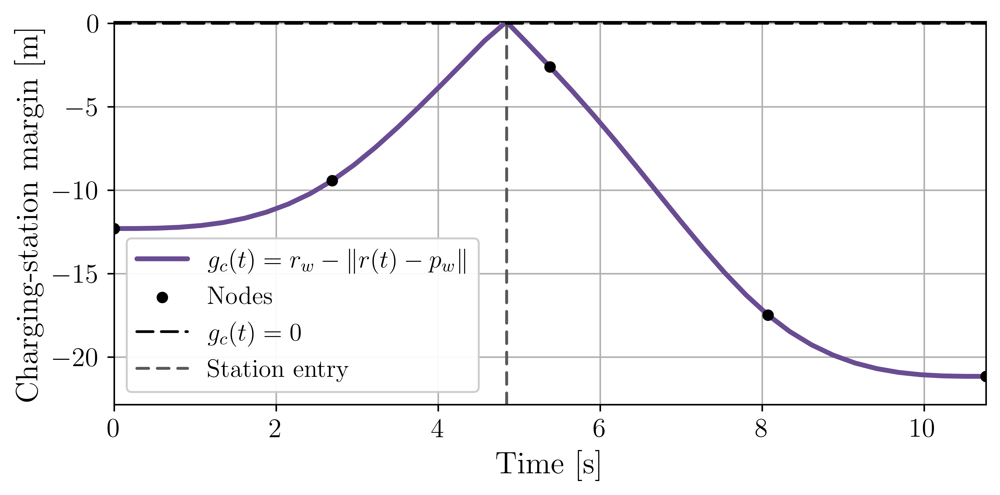

### Sequential Convex Programming for Trajectory Optimization with Continuous-Time Satisfaction of Signal Temporal Logic Specifications

This repository contains demonstrative examples of trajectory optimization under continuous-time Signal Temporal Logic (STL) specifications, solved using sequential convex programming.

#### Main Example

**Task:** Eventually visit two dynamic waypoints and reach the end zone while always avoiding dynamic obstacles.

  

---

#### Demonstrative Examples

##### Problem 1: Always avoid obstacles

##### Problem 2: Eventually visit three waypoints

##### Problem 3: Until visiting the charging station, the speed must remain below the threshold

- **Case 1**

- **Case 2**

  
  

